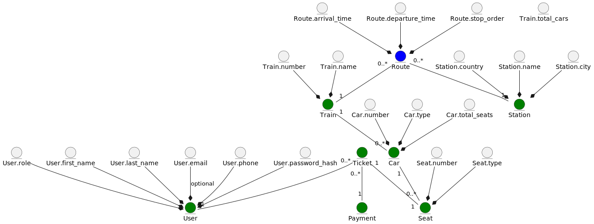

# Моделі


## Загальна модель бізнес-об'єктів

<div hidden>

```
@startuml business-objects-model

entity User #green
entity Train #green
entity Station #green
entity Route #blue
entity Car #green
entity Seat #green
entity Ticket #green
entity Payment #green

entity User.first_name
entity User.last_name
entity User.email
entity User.phone
entity User.password_hash
entity User.role

entity Train.number
entity Train.name
entity Train.total_cars

entity Station.name
entity Station.city
entity Station.country

entity Route.arrival_time
entity Route.departure_time
entity Route.stop_order

entity Car.number
entity Car.type
entity Car.total_seats

entity Seat.number
entity Seat.type

Ticket "0..*" -- "1" User
Ticket "0..*" -- "1" Payment
Ticket "1" -- "1" Seat

Route "0..*" -- "1" Train
Route "0..*" -- "1" Station

Train "1" -- "0..*" Car
Car "1" -- "0..*" Seat


User.first_name --* User
User.last_name --* User
User.email --* User : optional
User.phone --* User
User.password_hash --* User
User.role --* User

Train.number --* Train
Train.name --* Train

Station.name --* Station
Station.city --* Station
Station.country --* Station

Route.arrival_time --* Route
Route.departure_time --* Route
Route.stop_order --* Route

Car.number --* Car
Car.type --* Car
Car.total_seats --* Car

Seat.number --* Seat
Seat.type --* Seat


@enduml
```

</div>

