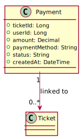

# Моделі


## Загальна модель бізнес-об'єктів

<div hidden>

```
@startuml

entity User #green
entity Train #green
entity Station #green
entity Route #blue
entity Car #green
entity Seat #green
entity Ticket #green
entity Payment #green

entity User.first_name
entity User.last_name
entity User.email
entity User.phone
entity User.password_hash
entity User.role

entity Train.number
entity Train.name
entity Train.total_cars

entity Station.name
entity Station.city
entity Station.country

entity Route.arrival_time
entity Route.departure_time
entity Route.stop_order

entity Car.number
entity Car.type
entity Car.total_seats

entity Seat.number
entity Seat.type

Ticket "0..*" -- "1" User
Ticket "0..*" -- "1" Payment
Ticket "1" -- "1" Seat

Route "0..*" -- "1" Train
Route "0..*" -- "1" Station

Train "1" -- "0..*" Car
Car "1" -- "0..*" Seat


User.first_name --* User
User.last_name --* User
User.email --* User : optional
User.phone --* User
User.password_hash --* User
User.role --* User

Train.number --* Train
Train.name --* Train

Station.name --* Station
Station.city --* Station
Station.country --* Station

Route.arrival_time --* Route
Route.departure_time --* Route
Route.stop_order --* Route

Car.number --* Car
Car.type --* Car
Car.total_seats --* Car

Seat.number --* Seat
Seat.type --* Seat


@enduml
```

</div>


## ER-модель

### User Service

<div hidden>

```
@startuml userservice

class User {
  +userId: Long
  +email: String
  +passwordHash: String
  +fullName: String
  +phoneNumber: String
  +role: String
  +createdAt: DateTime
  +updatedAt: DateTime
}

User "1" --> "0..*" Ticket : has

@enduml
```

</div>


### Train Service

<div hidden>

```
@startuml trainservice

class Train {
  +trainId: Long
  +trainNumber: String
  +name: String
  +totalCars: Int
  +createdAt: DateTime
}

class Station {
  +stationId: Long
  +name: String
  +city: String
  +country: String
  +createdAt: DateTime
}

class Route {
  +routeId: Long
  +trainId: Long
  +stationId: Long
  +arrivalTime: DateTime
  +departureTime: DateTime
  +stopOrder: Int
  +createdAt: DateTime
}

class Car {
  +carId: Long
  +trainId: Long
  +carNumber: Int
  +type: String
  +totalSeats: Int
}

class Seat {
  +seatId: Long
  +carId: Long
  +seatNumber: Int
  +type: String
}

Train "1" --> "0..*" Route : follows
Train "1" --> "0..*" Car : has
Car "1" --> "0..*" Seat : contains
Station "1" --> "0..*" Route : part of

Route "2" --> "1" Ticket : listed in
Seat "1" --> "1" Ticket : reserved by


@enduml
```

</div>


### Booking Service

<div hidden>

```
@startuml bookingservice
class Ticket {
  +ticketId: Long
  +userId: Long
  +trainId: Long
  +carId: Long
  +seatId: Long
  +departureStationId: Long
  +arrivalStationId: Long
  +price: Decimal
  +status: String
  +bookedAt: DateTime
}


Ticket "1" --> "1" User : belongs to
Ticket "1" --> "1" Seat : reserves
Ticket "1" --> "1" Payment : processes
Ticket "1" --> "1" Route : departure
Ticket "1" --> "1" Route : arrival

@enduml
```

</div>


### Payment Service

<div hidden>

```
@startuml paymentservice
class Payment {
  +ticketId: Long
  +userId: Long
  +amount: Decimal
  +paymentMethod: String
  +status: String
  +createdAt: DateTime
}

Payment "1" --> "0..*" Ticket : linked to

@enduml
```

</div>




### Notification Service

Не зберігає дані

</div>
